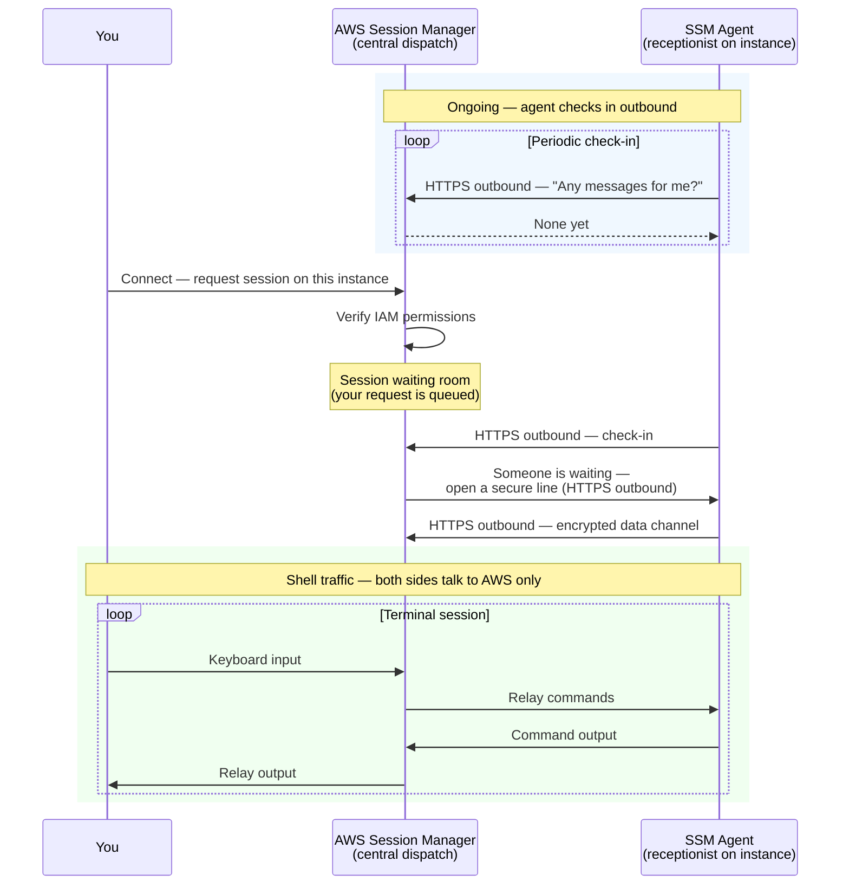

# No Inbound Ports Needed — How SSM Connectivity Works

> Concept article · Medium / long form  
> Status: draft · May 2026  
> **LinkedIn draft:** [No-Inbound-Ports-How-SSM-Connectivity-Works-LinkedIn.md](No-Inbound-Ports-How-SSM-Connectivity-Works-LinkedIn.md)

---

## What this article is — and is not

**This article explains *how* Session Manager connectivity works** — why “no inbound ports” is possible, who talks to whom, and how your click on **Connect** fits together with outbound traffic from the instance.

**It does *not* walk you through enabling Session Manager in AWS** (IAM roles, instance profiles, which boxes to tick in the console, or VPC endpoints). For that, use the companion draft **[Setup Session Manager on EC2 — Basics](Setup-Session-Manager-EC2-Basics.md)**.

If you already understand the idea but need **routing, security groups, and VPC endpoints** by scenario, see **[Session Manager Network Scenarios (Advanced)](Session-Manager-Network-Scenarios-Advanced.md)**.

---

**Title:** No Inbound Ports Needed — How SSM Connectivity Works

**Subtitle:** Why Session Manager feels like magic — and why you still click "Connect" even though nothing is listening on Port 22.

---

If you're getting started with AWS security, you've probably heard the golden rule for EC2: **don't open Port 22 to the world.**

AWS points you toward **Systems Manager Session Manager** — shell access to your instances without opening inbound ports in your security groups. The docs say it clearly: secure access with **zero inbound rules** required for the session itself.

So far, so good.

Then you try it, and something feels wrong.

If the connection is **outbound-only** from the instance, why do you log into the AWS Console and click **Connect**? How can *you* start a session from your laptop if the server isn't listening for your traffic?

It feels like a contradiction. Once you see who's talking to whom — and who opens the network connection — it clicks. This article explains that in plain terms, without drowning you in APIs or protocol names.

---

### The paradox in one sentence

**"Outbound-only" describes how the instance talks on the network. "You click Connect" describes how *you* ask AWS for a session.** Those are two different conversations.

---

### Two ways to reach a server

**Traditional SSH**

Imagine a high-security building. You walk up to the front door and knock. The building needs a **door** — Port 22 — and someone has to leave it unlocked enough for you to enter. Your security group is that door. Block inbound SSH, and you can't get in, even if you have the right key.

**Session Manager (SSM)**

Now imagine a **receptionist inside** the building — the **SSM Agent** on your instance:

- **The agent keeps checking in.** They don't wait at the door. Every few seconds they call **central dispatch** (the AWS Systems Manager service): "Any messages for me?"
- **You ask dispatch, not the building.** When you want a session, you don't knock on the instance. You call dispatch yourself — through the AWS Console or CLI: "I'd like to talk to **this** instance."
- **Dispatch waits for the next check-in.** It doesn't break into the building. When the receptionist calls again, dispatch says: "Yes — someone's waiting. Open a secure line back to me **right now**."
- **The agent opens the line outward.** The receptionist initiates an encrypted connection over HTTPS — the same kind of traffic browsers use — back to AWS.
- **No inbound door required.** Your security group never needs a rule for SSH or RDP just so you can get a shell.

That's the core idea people call a **reverse tunnel**: the server is the **dialer**, not the listener.

---

### What happens when you click "Connect"

You don't need to memorise API names. The flow is simple:

1. **You ask AWS** — "Start a session on this instance." AWS checks whether your IAM identity is allowed to do that.

2. **AWS holds your request** — Think of a waiting room in the cloud. Your session isn't on the instance yet; it's a request sitting with the service.

3. **The agent is already in touch** — The SSM Agent (pre-installed on many Amazon Linux and Ubuntu AMIs) maintains an ongoing outbound link to AWS. When you clicked Connect, AWS uses that path to tell the agent: "New session — set up the terminal channel."

4. **The agent calls home again** — For the actual shell traffic, the agent opens another **outbound** encrypted connection to AWS. No inbound port on your instance is required for you to type commands.

5. **You're in the middle, via AWS** — Your keyboard and screen talk to AWS; AWS relays traffic through the tunnel the agent opened. You're not typing directly onto the instance's network interface the way SSH clients do.

The sequence below matches the receptionist analogy and the five steps above. Notice every network connection **from the instance** goes **outbound** to AWS — never inbound from the internet to your instance.

So: **you** initiate the *request* (through AWS's control interface). The **instance** initiates the *network connections* (outbound to AWS). Both are true.

---

### Why your security group can stay locked down

Security groups are **inbound firewalls** on your instance. Session Manager sessions don't need you to punch holes for SSH (22) or RDP (3389) from the internet.

The agent reaches AWS over **outbound HTTPS** — typically port **443**. From the instance's point of view, it's making a normal encrypted request *out* to the cloud, like software checking for updates.

That's why people say **no inbound ports needed** for this access pattern: the path in is really a path **out**, then back through AWS's side of the tunnel.

---

### What you gain — and the one thing people forget

**Benefits**

- **Smaller attack surface** — No public listener waiting for brute-force SSH attempts.
- **No bastion host required** for many setups — fewer boxes to patch and pay for.
- **IAM instead of shared keys** — Who can connect is an AWS permission problem, not a `.pem` file on someone's laptop.
- **Audit-friendly** — Session Manager can log session activity to S3 or CloudWatch (when you turn logging on), which helps compliance conversations.

**The caveat (important)**

Outbound-only doesn't mean "no network requirements." The instance still needs a **path to AWS**:

- Out to the internet via a NAT gateway or public subnet, **or**
- **VPC interface endpoints** for Systems Manager and related services in private subnets with no internet at all.

If the agent can't reach AWS, clicking Connect won't help — dispatch never reaches the receptionist. Plan outbound connectivity (or endpoints) the same way you'd plan any other AWS integration.

You'll also need the agent **installed and running**, and the instance must have an **IAM role** that allows it to talk to Systems Manager. Those are **implementation details**, covered in **[Setup Session Manager on EC2 — Basics](Setup-Session-Manager-EC2-Basics.md)** — not the focus of this piece.

---

### When Session Manager is a good fit

Session Manager shines when you want **locked-down networks** and **centralised access control**: production VPCs with tight security groups, teams that shouldn't pass SSH keys around, and environments where you want sessions tied to AWS identities rather than long-lived secrets.

It's not a replacement for every tool — some teams still use SSH or other access for specific workflows — but for "get a shell without opening Port 22," it's the pattern AWS designed for.

---

### Takeaway

Session Manager isn't breaking the laws of networking. It's **changing who dials whom**.

- **SSH:** you connect *to* the instance; the instance must listen.
- **Session Manager:** you ask *AWS*; the instance calls *AWS*; traffic flows through a tunnel neither side exposes as a public inbound service.

No inbound ports needed on your instance for that shell — not because the connection ignores physics, but because **the instance always calls outbound first**.

If the "outbound-only but I click Connect" puzzle was nagging you, you're not alone. Now you know: you're talking to dispatch. The receptionist calls home.

---

**Further reading (AWS documentation)**

- [Session Manager](https://docs.aws.amazon.com/systems-manager/latest/userguide/session-manager.html) — what it is and how to enable it  
- [Setting up Session Manager](https://docs.aws.amazon.com/systems-manager/latest/userguide/session-manager-getting-started.html) — agent, IAM role, and logging  
- [Using Session Manager with private subnets](https://docs.aws.amazon.com/systems-manager/latest/userguide/session-manager-troubleshooting.html) — connectivity and VPC endpoints  

---

<!-- Publishing notes
Medium: copy from Title through Takeaway; add tags: AWS, Security, DevOps, EC2, Systems Manager
Mermaid sequence diagram included (Medium may need export from mermaid.live if unsupported)
LinkedIn: use No-Inbound-Ports-How-SSM-Connectivity-Works-LinkedIn.md
-->
